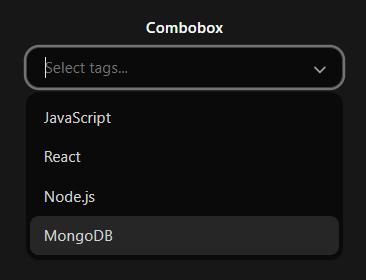
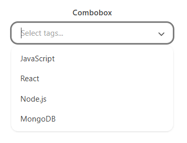

# Combobox Component

The `Combobox` is a searchable dropdown component built using React and TailwindCSS. It allows users to type to filter options and select from a dynamic list. It's ideal for large datasets or when users need search capabilities within a dropdown.

## Features

- Fully searchable with live filtering
- Accessible with keyboard and screen readers
- Dark mode support
- Click outside to close & ESC key handling
- Custom label and value keys

## Installation

Copy the `Combobox.jsx` file into your components folder.

Then import and use like this:

```jsx
import Combobox from './Combobox';
```

## Preview

 
 

## Quick Usage

```jsx
const options = [
  { id: 1, name: 'React' },
  { id: 2, name: 'Vue' },
  { id: 3, name: 'Svelte' },
];

const [selected, setSelected] = useState(null);

<Combobox
  selected={selected}
  setSelected={setSelected}
  options={options}
  labelKey="name"
  valueKey="id"
/>
```
