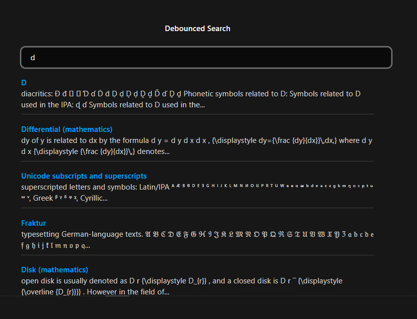
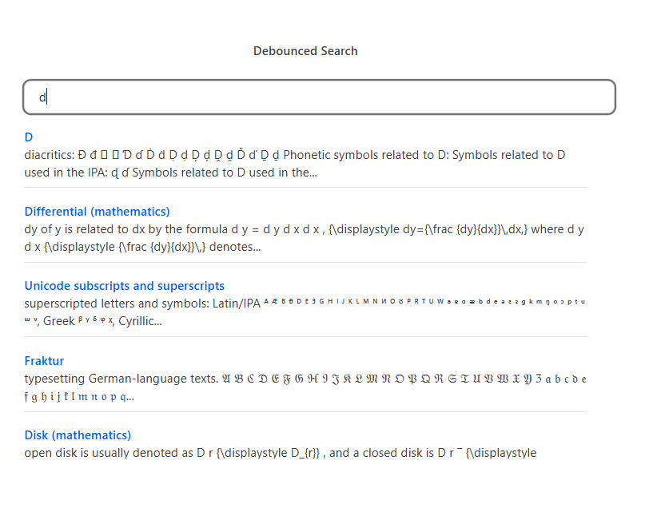

# DebouncedSearchNormal

The `DebouncedSearchNormal` is a simple React component that demonstrates how to implement debounced search functionality using the Wikipedia API. It delays API calls while the user is typing to avoid unnecessary requests.

## Features

- Real-time debounced search
- Wikipedia API integration
- Clean and responsive UI
- Dark mode support
- Minimal setup

## Installation

Copy the component to your `components` folder:

```bash
components/
└── DebouncedSearchNormal.jsx
```

Then import and use like this:

```jsx
import DebouncedSearchNormal from './DebouncedSearchNormal';
```

## Preview

 
 


## Basic Usage

```
import DebouncedSearchNormal from './components/DebouncedSearchNormal';

function App() {
  return (
    <div>
      <h1>Wikipedia Search</h1>
      <DebouncedSearchNormal />
    </div>
  );
}
```
