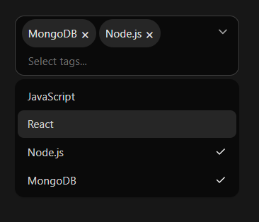

# Selectlist Component

The `MultiSelectCombobox` is a reusable React component that allows users to select multiple options from a searchable dropdown list with tagging support. It includes keyboard accessibility, dark mode support, and responsive behavior.

## Features

- Select multiple options
- Filter/search through options
- Display selected items as removable tags
- Responsive and dark mode-ready
- Keyboard and screen-reader accessible

## Installation

Copy the `MultiSelectCombobox` component into your project's `components` folder.
```bash
components/
└── MultiSelectCombobox.jsx
```

Then import and use like this:

```jsx
import MultiSelectCombobox from './MultiSelectCombobox';
```

## Preview

 
 

## Quick Usage

```jsx
import MultiSelectCombobox from './components/MultiSelectCombobox';

const [selectedItems, setSelectedItems] = useState([]);
const options = [
  { id: 1, name: "Option A" },
  { id: 2, name: "Option B" },
];

<MultiSelectCombobox
  selected={selectedItems}
  setSelected={setSelectedItems}
  options={options}
/>

```
