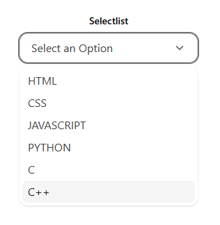
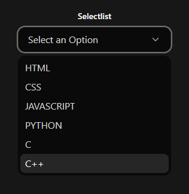

# Selectlist Component

The `Selectlist` is a fully accessible and customizable dropdown component built with React and TailwindCSS. It supports dynamic options and allows the parent to control the selected state, making it reusable for any dataset or structure.

## Features

- Keyboard and screen reader accessible
- Click outside to close
- Customizable label and value keys
- Dark mode support
- Visual checkmark for selected item

## Installation

Copy the `Selectlist.jsx` file into your project.

Then import and use like this:

```jsx
import Selectlist from './Selectlist';
```

## Preview

 
 

## Quick Usage

```jsx
const options = [
  { id: 1, name: 'React' },
  { id: 2, name: 'Vue' },
  { id: 3, name: 'Svelte' },
];

const [selected, setSelected] = useState(null);

<Selectlist
  selected={selected}
  setSelected={setSelected}
  options={options}
  labelKey="name"
  valueKey="id"
/>
```
